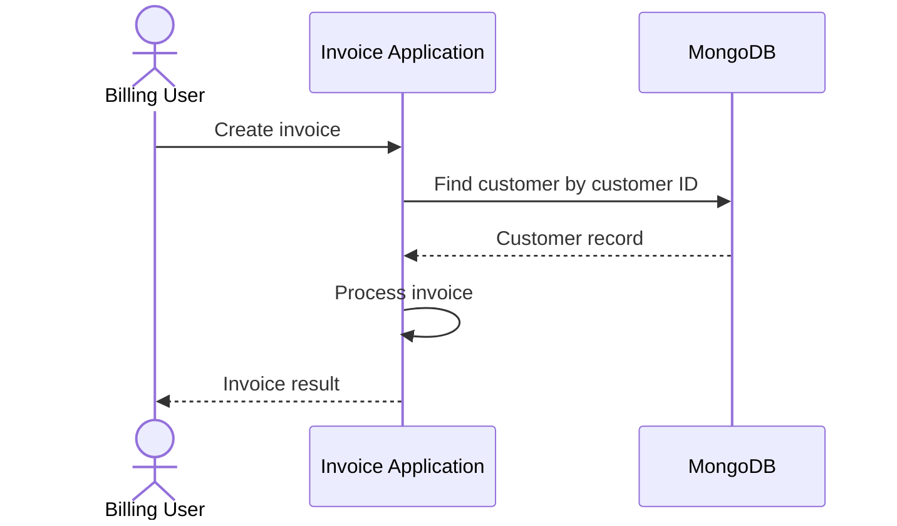

# Invoice Processing Design

## Overview

The invoice application creates invoices using customer records stored in a local MongoDB database.

The application retrieves customer data from MongoDB and contains the application logic for invoice creation.

## High Level Architecture


### Invoice Application

The Python application is responsible for invoice processing, including customer lookup, invoice line validation, and total calculation.

### MongoDB

A local MongoDB database stores customer records used by the invoice application.

## Customer Data

Customer records are stored in a `customers` collection.

Example document:

```json
{
  "customer_id": 101,
  "name": "Avery"
}
```

The application retrieves a customer using `customer_id`.

## Invoice Creation Flow


